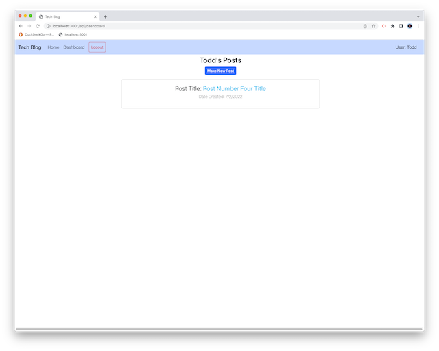
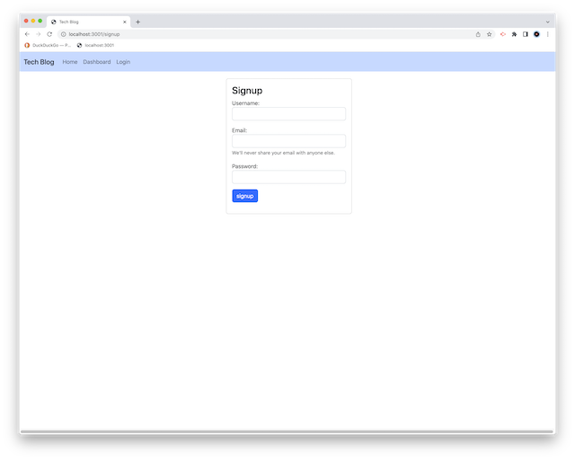

# 14-MVC-Tech-Blog

## Table of Contents-
- [Tech Blog using MVC Format](#mvc-tech-blog)
  - [Table of Contents-](#table-of-contents-)
  - [Licensing](#licensing)
  - [Description](#description)
  - [Installation](#installation)
  - [Screenshots](#screenshots)
  - [Usage](#usage)
  - [Credits](#credits)
  - [Contributing](#contributing)
  - [Testing](#testing)
  - [Additional Info](#additional-info)

## Licensing

Link: [MIT License](https://opensource.org/licenses/MIT)

## Description

A simple "Tech Blog" website using the Model-View-Controller format. A MySQL database is used to store User data, as well as Posts and Comments on those Posts. Database modelling is done through the Sequelize ORM for MySQL. The API ("Controller") functions are accessed using Express.js web application framework. The "View" functions are provided by Handlebars.js templating system.

## Installation

NOTE: As of November 2022, Heroku has no "free" accounts, so the demo application has been taken offline until another suitable host can be found.

Can also be installed locally by copying directory structure as-is, then doing a `npm install` in the base directory to install necessary dependancies. Application database is MySql, and the database container can be created by navigating to the `/db` directory and then using the MySQL command line utility and the `SOURCE` command to create it. Data tables can be seeded into the container after this by navigating to the `/seeds` directory and using the command `node seed.js` to create them.

## Screenshots

Base page

User login page

User now logged in

Add a comment to a post

User 'Dashboard' page

Editing a post

User sign-up page

## Usage

To run when installed locally: The app server is launched by Node, type the command 'node server.js' to start the back-end. Then launch a web browser and go to the URL 'localhost:3001/' to get the inital page.

## Credits

This application uses the following technologies/libraries:  

[Express.js v4.0](https://expressjs.com/)

[Sequelize v6](https://sequelize.org/)

[MySQL v8.0](https://www.mysql.com/)

[dotenv](https://www.npmjs.com/package/dotenv)

## Contributing

  [Contributor Covenant](https://www.contributor-covenant.org/)

## Testing

  No testing is provided.

## Additional Info

- Github: [cliff-rosenberg](https://github.com/cliff-rosenberg)
- Email: cliff459 AT icloud.com
